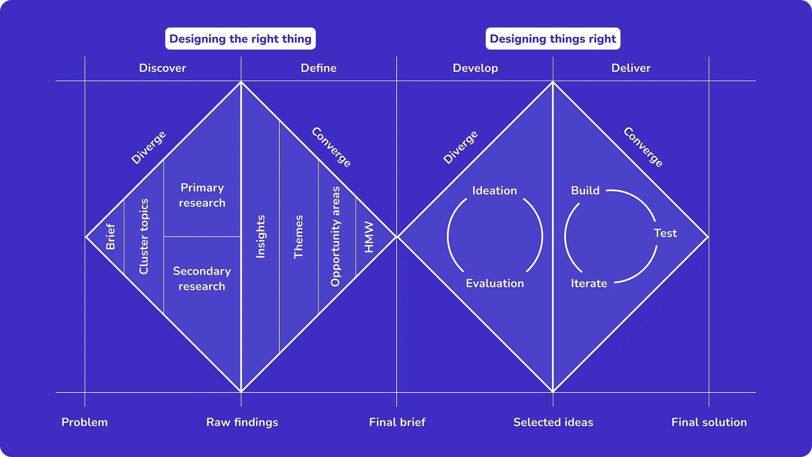
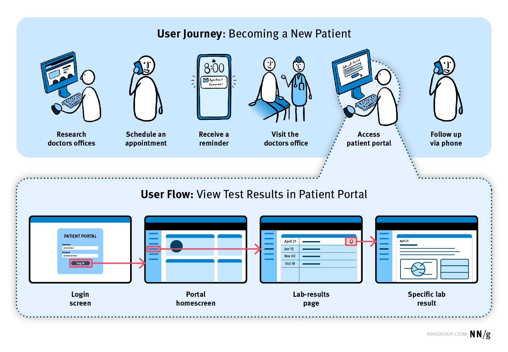

---
date:
  created: 2025-04-27

icon: material/book-open-blank-variant-outline
---
## Topic

Designing for Users: From Interface History to Modern Design Processes

---
## Reading Material

> [!abstract]- "Dark Horse Innovation, 2017. "Digital innovation playbook: The handbook for digital transformation, new business models, and technologies". 4th ed. Munich: Hanser."
>
> [digitalinformation.pdf](texts/week6/week6_digital_information.pdf)
>
> 1) **What are the new terms in this text? How are they defined? Where do they come from?**
>- How-Might-We Question: The problem hypothesis that describes an unsolved user need based on insights gained.
>- Innovation Board: Accompanies the most important steps of digital innovation and consists of three modules: explore, create, and evaluate
>- Explore Module: It is where discoverers typically start. Its purpose is to get to know the users and recognize their needs, preferences, and decision-making considerations
>- Create Module: This module is used to design new or better solutions for users. It is where designers typically start
>- Evaluate Module: In this module, the role is that of critical minds who adjust and review solutions and make them usable for the company. It is used to contact users again and validate various aspects of an idea, such as its relevance, whether it solves the problem, and if users would use or pay for it
>
> 2) **Who are the authors? Where do they work? Who do they refer to?**
>
>- Dark Horse Innovation is an "innovation consultancy", helping companies to develop digital products and services. They are based in germany
>
> 3) **What questions come to your mind from reading this text?**
>
>- The text highlights the importance of "gut feeling" and subjective interpretation (for example when developing personas). How is consistency and objectivity maintained when you have to rely on your gut feeling? 
>
> 4) **How does it affect your design practice? What applications do you see in your practice?**
>
>- Basically all of the mentioned methods and structures are helpful when designing things, and i will be revisiting different chapters in this book a lot in the forseeable future.

---

## Brief Summary of Lesson

This lesson focused on the history of User Design / User Experience.

Some figures/topics which i found interesting

>[!info] Henry Dreyfuss
>https://en.wikipedia.org/wiki/Henry_Dreyfuss 

>[!info ] [!info] Douglas Engelbart
>https://en.wikipedia.org/wiki/Douglas_Engelbart 

>[!info] Susan Kare (Apple, Icons)
>https://en.wikipedia.org/wiki/Susan_Kare

>[!info] Muriel Cooper (information landscapes)
>https://en.wikipedia.org/wiki/Muriel_Cooper

>[!info] Don Norman
>Coined the term "UX"
>https://en.wikipedia.org/wiki/Don_Norman

First GUI (Desktop): Xerox Star, 1981 --> Pinoeer of UI/UX
First *successful* GUI product: Apple Macintosh, 1984

Double Diamond method

Design Thinking Mindset

Personas:

User Journey (vs user flow):

Useful channel: youtube.com/nngroup.com

---

## Takeaways

The main takeaway for me was the "digital innovation" book, and the nngroup youtube channel, which both already were very useful in the GUI 2 module.